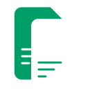

# Resume Builder

Resume Builder is a free and simple tool that allows users to build their resumes without any sign-up required. This project uses Next.js, Zustand, and i18n for localization, making it flexible for future language expansion.

<a href="https://resume.anarr.dev">resume.anarr.dev</a>

## Features

- Build a professional resume with ease.
- No sign-up required for creating and downloading resumes.
- Multilingual support with initial language options (English and Azerbaijani).
- Data is stored locally in the browser using `localStorage`.

## Technologies Used

- **Next.js**: A React framework for building modern web applications.
- **i18n**: Internationalization for easy language support.
- **Zustand**: A simple, fast state management tool for React.
- **localStorage**: Used for storing data locally in the user's browser to avoid reliance on external servers.

## Localization

The app currently supports English and Azerbaijani languages (i18n). You can easily extend this by adding more language files and updating the `i18n` configuration.

## Security

Data entered by users is stored securely in the browser's `localStorage`. Please refer to the [security documentation](SECURITY.md) for more information about how the data is handled and stored.

## TODO

- Add more templates for different types of resumes.
- Implement resume customization options for users.
- Extend multilingual support with additional languages.
- Enhance UI/UX design for a better user experience.

## Contributing

If you'd like to contribute to the project, please check out the [Contributing Guide](CONTRIBUTING.md).

## License

This project is licensed under the MIT License - see the [LICENSE](LICENSE) file for details.

## Contact

For any inquiries, please contact me at [mail@anarr.dev].
